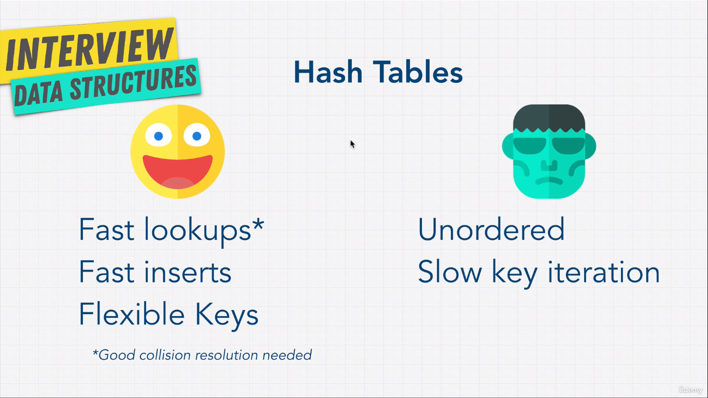

## Learning Materials

### 1. MD5 Hash Generator - [Link](https://www.miraclesalad.com/webtools/md5.php)

### 2. Hashing Collision Visualization [Link](https://www.cs.usfca.edu/~galles/visualization/OpenHash.html)

