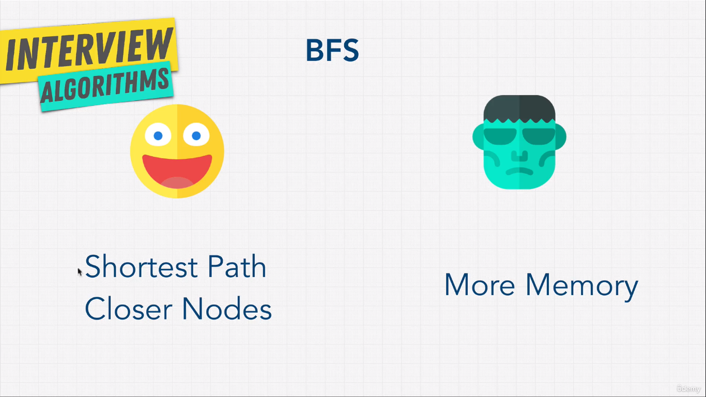
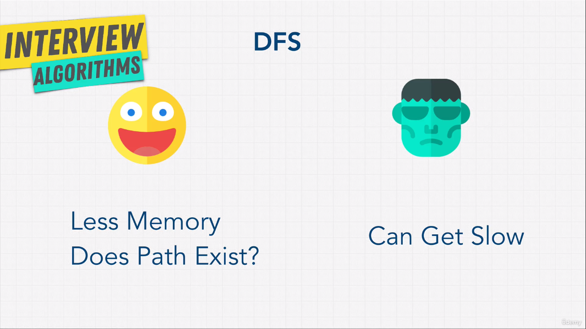

## Searching Learning Materials

1. Graph Traversal Visualization [Link](https://visualgo.net/en/dfsbfs)

## Features of Breadth First Search

## Features of Depth First Search

## Shortest Path Algorithms

1. Dijkstra's Algorithm : Does not support negative numbers, but it is the faster algorithm.
2. Bellman Ford's Algorithm: Supports negative numbers, but it is the slower algorithm.
